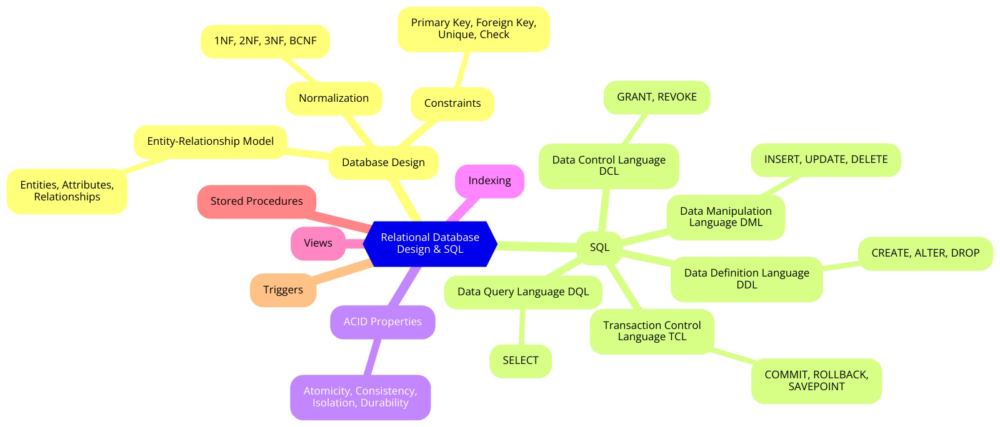

# Comprehensive Overview of Data Management Systems: From Relational to NoSQL

## [Relational Database Design and SQL](concept_map_rdbms.md)

This document provides a detailed **concept map** that visualizes the relationships between the core components of **Relational Database Design and SQL**. It organizes foundational topics such as **Normalization**, **Entity-Relationship (ER) Model**, **ACID Properties**, and various SQL sublanguages like **DDL**, **DML**, and **TCL**. The map highlights the central role of relational database management and SQL in ensuring structured, consistent, and optimized data storage and retrieval.

Key topics include:
- **Normalization**: The process of organizing data to reduce redundancy and improve data integrity.
- **ER Model**: Graphically represents entities and their relationships in the database.
- **ACID Properties**: Guarantees transaction reliability with Atomicity, Consistency, Isolation, and Durability.
- **SQL Sublanguages**: The different functions of SQL (DDL, DML, TCL, DCL) to define, manipulate, and control the database.

This concept map serves as a foundational guide for understanding the core elements of a relational database and how SQL is applied to effectively manage and query data.

## [From Relational to NoSQL](concept_map_nosql.md)

This document presents a **concept map** for understanding the architecture and key differences among **NoSQL Database Systems**. It explores the **Relational Problem** and how NoSQL solutions like **MongoDB**, **Cassandra**, **Redis**, and **Neo4j** address the limitations of traditional relational databases in handling Big Data. The map focuses on the scalability, flexibility, and structure of NoSQL systems while explaining their data models, including **Document Store**, **Key-Value Store**, and **Graph Store**.

Key elements include:
- **The Relational Problem**: Scalability and flexibility limitations of traditional RDBMS for Big Data and unstructured data.
- **NoSQL Data Models**:
  - **Document Store** (e.g., MongoDB): Flexible schema for semi-structured data.
  - **Key-Value Store** (e.g., Redis): Efficient for high-performance caching.
  - **Graph Store** (e.g., Neo4j): Ideal for data with complex relationships.
  - **Column Store** (e.g., Cassandra): Designed for large-scale distributed databases.

This map is ideal for users who want to explore modern database systems capable of managing Big Data and the increasing demand for flexibility and scalability in data storage.

## [Designing a Relational Database for Efficient Bookstore Management](rdbms_for_bookstore.md)

This document provides a practical example of how **Relational Database Management Systems (RDBMS)** can be applied to a real-world scenario by outlining an RDBMS design for a **bookstore**. It explains the use of **entities**, **attributes**, and **relationships** to model the bookstore's operations, such as managing books, authors, customers, and orders. The design includes normalization processes, the creation of tables, and the use of **SQL** to efficiently manage and query the data.

Main components include:
- **Entities**: Representing objects like books, authors, customers, and orders.
- **Relationships**: Defining connections between entities, such as customers placing orders or authors writing books.
- **Normalization**: Ensuring data integrity and reducing redundancy by organizing the data into normalized forms (1NF, 2NF, 3NF).
- **SQL Queries**: Examples of how SQL can be used to retrieve, update, and manage bookstore data, such as finding all orders by a specific customer or checking stock availability.

## [Analyzing Business Insights from the Classic Models Database Using SQL Queries](classic_models_insights.md)

This article focuses on solving three key business problems for **Classic Models** by analyzing different aspects of the company's operations using SQL queries. Each problem addresses a specific business need, extracting valuable insights from the data stored in the Classic Models database. 

The three problems focus on:
1. **Top-Selling Products Analysis**: Identifying the top-selling products based on total quantity ordered and sales amount, providing insights for inventory management and marketing.
2. **Sales Performance by Office**: Evaluating the total sales generated by employees from each office to determine resource allocation and recognize high-performing teams.
3. **High-Value Customers Identification**: Identifying customers who have made payments exceeding $50,000, helping strengthen relationships with the most valuable clients.

This analysis provides actionable insights to improve inventory management, resource allocation, and customer relationship strategies, leveraging SQL for efficient data retrieval and decision-making.

