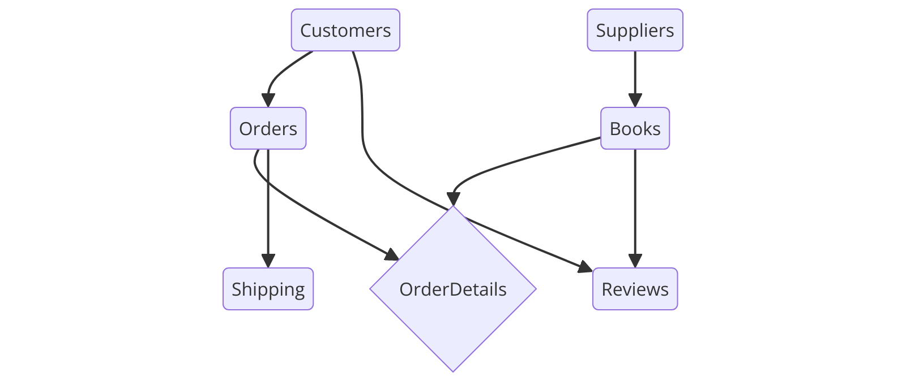
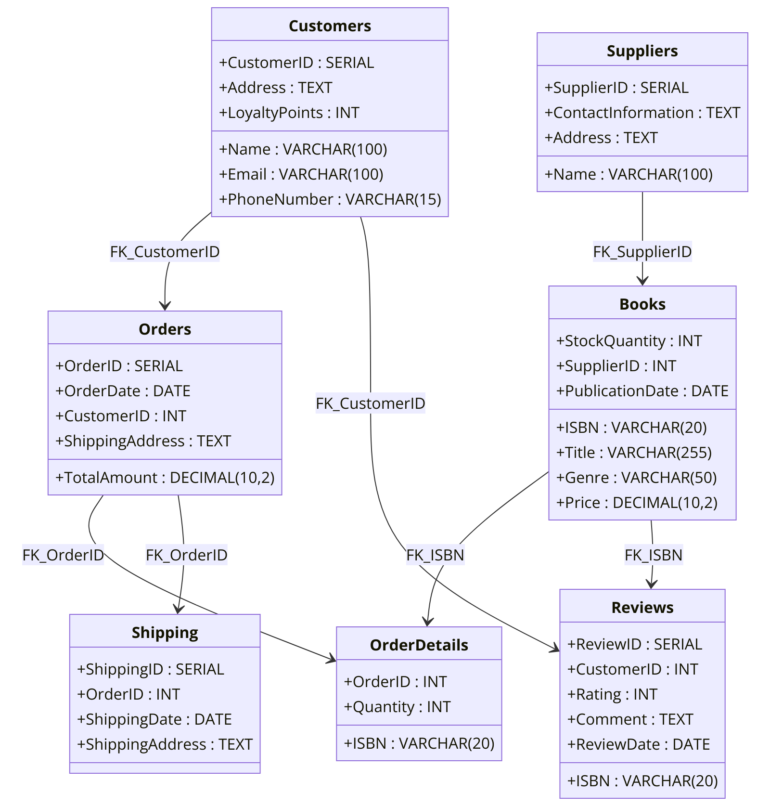

# Designing a Relational Database for Efficient Bookstore Management

## Introduction

In today’s digital age, efficient management of data is crucial for the success of any business. **"The Reading Nook"**, a small independent bookstore, faces the challenge of managing a growing customer base, online orders, inventory, and supplier relationships. To streamline these operations, this project aims to design a relational database system that can handle the daily tasks of the bookstore more efficiently.

The purpose of this project is to create a fully normalized relational database for **"The Reading Nook"** that will optimize its operations, improve data accuracy, and provide a foundation for future growth. This report details the steps involved in designing the database, from understanding the business requirements to developing an Entity Relationship Diagram (ERD), converting it to a relational model, and ensuring it is normalized to Third Normal Form (3NF).

### Goals and Objectives
- **Goal 1**: To design a database that manages **customers, orders, books, suppliers, loyalty programs, and shipping** efficiently.
- **Goal 2**: To **optimize data integrity** by creating a relational model that avoids redundancy and ensures consistency.
- **Goal 3**: To develop a scalable database structure that can accommodate the **growing needs** of both the bookstore’s in-store and online operations.
- **Goal 4**: To provide an organized system for tracking **customer reviews**, ensuring valuable feedback for future purchases.
- **Goal 5**: To streamline business operations, ensuring easy **inventory management**, customer tracking, and supplier interaction.


## Business Background

### Description of the Bookstore Business

**"The Reading Nook"** is a cozy, independent bookstore located in a lively urban area. Established over a decade ago, it started as a small second-hand bookstore and has since evolved into a community hub for book lovers, offering a wide range of genres including bestsellers, children's books, academic texts, and classic literature. 

In addition to the physical store, **"The Reading Nook"** has recently expanded its reach by launching an online store. This allows customers to browse and order books online, with options for home delivery or in-store pickup. The business also introduced a **loyalty program**, rewarding frequent customers with discounts and special offers.

### Business Operations and Challenges

As **"The Reading Nook"** has expanded, its operations have become more complex. Managing **inventory** has become a challenge, particularly with both in-store and online orders. Tracking **customer preferences**, **supplier relationships**, and **sales data** manually has led to inefficiencies and occasional data errors. The loyalty program also requires proper management to ensure that customer points are tracked accurately.

Furthermore, the store handles regular shipments of books from both **local and international suppliers**, and keeping track of incoming stock, supplier details, and reorders manually has resulted in operational delays. **Customer reviews** for online purchases are also becoming more important, but the current system lacks an efficient way to collect, store, and analyze them.

### The Need for a Database Solution

To address these challenges, **"The Reading Nook"** needs a modern database system that can streamline operations, improve **data accuracy**, and reduce manual labor. A well-designed relational database would provide the store with:
- A **centralized system** for tracking inventory, customer data, orders, and suppliers.
- The ability to track **customer loyalty** points and redemption activities.
- Real-time visibility into **sales trends** and **inventory levels**.
- A **seamless integration** between in-store and online sales.
- An organized method for collecting and analyzing **customer reviews**.

By implementing a relational database, **"The Reading Nook"** will not only improve its internal operations but also enhance the customer experience, both in-store and online, creating a stronger foundation for continued growth.


## Assumptions and ER Model

### Assumptions for the Bookstore Business



To create a clear and structured database for **"The Reading Nook"**, the following assumptions are made:

1. **Customers**:
   - Each customer has a unique **CustomerID**, which is used to track all customer-related activities.
   - Customers can make both **in-store** and **online purchases**.
   - Customers may participate in a **loyalty program** that rewards them with points based on the amount they spend, which can be redeemed for future discounts.
   - Customer details include basic personal information such as **name**, **email**, **phone number**, **address**, and their accumulated **loyalty points**.
   - Customers are able to leave **reviews** for books they have purchased online.

2. **Books**:
   - Each book is uniquely identified by its **ISBN**.
   - Books are categorized by their **genre** and associated **authors**.
   - Book details include the **title**, **price**, **quantity in stock**, the **supplier**, and the **publication date**.
   - Customers can leave **reviews** for books they’ve purchased, which include a **rating** and **comment**.

3. **Suppliers**:
   - Each supplier has a unique **SupplierID**.
   - Suppliers provide multiple books to the store and are responsible for keeping inventory stocked.
   - Supplier details include their **name**, **contact information**, and **address**.

4. **Orders**:
   - Each order has a unique **OrderID**.
   - Orders can be made either **in-store** or **online**.
   - For online orders, **shipping information** (including shipping address and shipping date) is included.
   - An order can contain multiple books, and each order is associated with a specific **CustomerID**.
   
5. **Loyalty Program**:
   - Customers earn **loyalty points** based on the amount they spend on purchases.
   - Loyalty points can be redeemed for discounts on future purchases.
   - The number of **loyalty points** is tracked within the customer entity.

6. **Reviews**:
   - Customers can submit **reviews** for books they’ve purchased online.
   - Reviews include a **rating** (out of 5 stars), a **comment**, and the **date** the review was submitted.
   - Reviews are linked to both the customer who submitted the review and the book being reviewed.

### Detailed Explanation of Entities

1. **Customer**:
   - Each customer is a key entity in the bookstore, tracked using a **CustomerID**. They may have multiple orders and participate in the loyalty program. Additionally, they can provide reviews for books they purchase online.

2. **Book**:
   - Books are the core product offered by the bookstore and are uniquely identified by their **ISBN**. They have attributes like **title**, **genre**, and **price**, and are restocked by various suppliers.

3. **Supplier**:
   - Suppliers provide books to the bookstore and have a unique **SupplierID**. The supplier's details such as their **contact information** and **address** are stored, and they are responsible for keeping books in stock.

4. **Order**:
   - Orders are placed by customers, and each order can include multiple books. Orders are tracked using a unique **OrderID**, and for online purchases, shipping details are included.

5. **OrderDetails**:
   - This is an intermediary entity to manage the **many-to-many** relationship between **Orders** and **Books**. Each entry in this table records the quantity of a specific book within an order.

6. **Review**:
   - Customers can submit reviews for books they purchase. Each review is identified by a **ReviewID**, and contains a **rating**, a **comment**, and a **review date**.

7. **Shipping**:
   - For online orders, shipping details such as **shipping address** and **shipping date** are stored. Each shipping record is linked to an **OrderID**.

### Attributes and Relationships

1. **Customer**:
   - **Attributes**: CustomerID (PK), Name, Email, PhoneNumber, Address, LoyaltyPoints.
   - **Relationship**: A **Customer** can place multiple **Orders** (1:N), and they can leave multiple **Reviews** for books (1:N).

2. **Book**:
   - **Attributes**: ISBN (PK), Title, Genre, Price, StockQuantity, SupplierID (FK), PublicationDate.
   - **Relationship**: A **Book** can be part of multiple **Orders** (N:M via **OrderDetails**) and can have multiple **Reviews** written by customers (1:N).

3. **Supplier**:
   - **Attributes**: SupplierID (PK), Name, ContactInformation, Address.
   - **Relationship**: A **Supplier** can provide multiple **Books** (1:N).

4. **Order**:
   - **Attributes**: OrderID (PK), OrderDate, CustomerID (FK), ShippingAddress (for online orders), TotalAmount.
   - **Relationship**: An **Order** can contain multiple **Books** (N:M via **OrderDetails**) and is placed by one **Customer** (N:1).

5. **OrderDetails**:
   - **Attributes**: OrderID (PK, FK), ISBN (PK, FK), Quantity.
   - **Relationship**: Connects **Orders** and **Books** in a many-to-many relationship (N:M).

6. **Review**:
   - **Attributes**: ReviewID (PK), CustomerID (FK), ISBN (FK), Rating, Comment, ReviewDate.
   - **Relationship**: A **Review** is written by one **Customer** (N:1) for one **Book** (N:1).

7. **Shipping**:
   - **Attributes**: ShippingID (PK), OrderID (FK), ShippingDate, ShippingAddress.
   - **Relationship**: Each **Order** can have one **Shipping** record (1:1 for online orders).

This ER model efficiently captures the essential elements of **"The Reading Nook"** bookstore and provides the foundation for developing a robust relational database system.


## Entity Relationship Diagram (ERD)

The Entity Relationship Diagram (ERD) for **"The Reading Nook"** visually represents the structure of the database and the relationships between different entities. The ERD outlines how customers, books, orders, suppliers, reviews, and shipping are interconnected. 



In this diagram:
- **Entities** are represented by rectangles (e.g., Customers, Books, Orders, Suppliers).
- **Attributes** are listed inside each entity (e.g., CustomerID, ISBN, OrderID).
- **Primary keys (PK)** are underlined to distinguish them as unique identifiers for each entity.
- **Foreign keys (FK)** represent the relationships between entities (e.g., CustomerID in Orders).
- **Relationships** between entities are shown using lines and crow’s feet notation, representing one-to-many (1:N) or many-to-many (N:M) connections.

### Explanation of Key Entities and Relationships

1. **Customer**:
   - **Attributes**: CustomerID (PK), Name, Email, PhoneNumber, Address, LoyaltyPoints.
   - **Relationships**:
     - A **Customer** can place multiple **Orders**. This is a one-to-many (1:N) relationship, where each customer can have many orders, but each order is placed by a single customer.
     - A **Customer** can also leave multiple **Reviews** for different books. This is also a one-to-many (1:N) relationship.

2. **Book**:
   - **Attributes**: ISBN (PK), Title, Genre, Price, StockQuantity, SupplierID (FK), PublicationDate.
   - **Relationships**:
     - A **Book** can appear in multiple **Orders**, but each order may contain multiple books. This creates a many-to-many (N:M) relationship between **Orders** and **Books**, which is resolved by the **OrderDetails** entity.
     - A **Book** can also have multiple **Reviews** written by different customers. This is a one-to-many (1:N) relationship.

3. **Supplier**:
   - **Attributes**: SupplierID (PK), Name, ContactInformation, Address.
   - **Relationships**:
     - A **Supplier** can supply multiple **Books**. This is a one-to-many (1:N) relationship, where each supplier can provide many books, but each book has only one supplier.

4. **Order**:
   - **Attributes**: OrderID (PK), OrderDate, CustomerID (FK), ShippingAddress, TotalAmount.
   - **Relationships**:
     - An **Order** can contain multiple **Books**, creating a many-to-many (N:M) relationship between **Orders** and **Books** through the **OrderDetails** table.
     - Each **Order** is placed by a single **Customer**. This is a one-to-many (N:1) relationship, as multiple orders can be placed by one customer.

5. **OrderDetails**:
   - **Attributes**: OrderID (PK, FK), ISBN (PK, FK), Quantity.
   - **Purpose**: The **OrderDetails** entity resolves the many-to-many (N:M) relationship between **Orders** and **Books** by linking the **OrderID** to the **ISBN** of the books included in the order. It also tracks the **quantity** of each book in the order.

6. **Review**:
   - **Attributes**: ReviewID (PK), CustomerID (FK), ISBN (FK), Rating, Comment, ReviewDate.
   - **Relationships**:
     - A **Customer** can write multiple **Reviews** for multiple **Books**, establishing a many-to-many (N:M) relationship between **Customers** and **Books** through the **Review** entity. Each review is linked to a specific customer and book.

7. **Shipping**:
   - **Attributes**: ShippingID (PK), OrderID (FK), ShippingDate, ShippingAddress.
   - **Relationships**:
     - Each **Order** can have one corresponding **Shipping** record, making it a one-to-one (1:1) relationship. The shipping record includes details like the shipping address and date.

### ERD Design Considerations

When designing the ERD, several key considerations were taken into account to ensure that the database structure is efficient, scalable, and optimized for **data integrity**:

1. **Normalization**: The ERD was developed with normalization in mind to reduce data redundancy and improve data integrity. Each entity is designed to store atomic data, ensuring the database is normalized up to **Third Normal Form (3NF)**.
   
2. **Foreign Keys and Referential Integrity**: All relationships between entities use foreign keys (e.g., **CustomerID** in **Orders**) to ensure referential integrity. This guarantees that records in related tables are consistent, and cascading updates or deletes can be enforced.
   
3. **Handling Many-to-Many Relationships**: The **many-to-many** relationships between **Orders** and **Books** are managed through the intermediary table **OrderDetails**, which tracks each book's quantity in an order. Similarly, the **Reviews** table resolves the many-to-many relationship between **Customers** and **Books**.

4. **Scalability**: The design allows for future growth, including additional entities or attributes as **"The Reading Nook"** expands. For example, the **Loyalty Program** can be extended with more advanced features such as tracking customer points across multiple stores.

In conclusion, the ERD for **"The Reading Nook"** provides a clear and organized visual representation of the database structure, ensuring that the system will be able to handle the bookstore’s current and future needs efficiently.


## Conversion of ERD to Relational Model

### Relational Model Structure

The relational model for **"The Reading Nook"** is derived directly from the Entity Relationship Diagram (ERD). It consists of seven key tables, each representing an entity from the ERD, with attributes defined for each table, including primary keys and foreign keys. The relationships between entities are established using foreign keys and composite keys where necessary.

### Primary Keys, Foreign Keys, and Relationships

1. **Customers Table**:
   - **Primary Key**: `CustomerID`
   - **Attributes**: Name, Email, PhoneNumber, Address, LoyaltyPoints
   - **Relationship**: A customer can place multiple orders, represented by the one-to-many relationship between **Customers** and **Orders** through the foreign key `CustomerID` in the **Orders** table.

2. **Books Table**:
   - **Primary Key**: `ISBN`
   - **Attributes**: Title, Genre, Price, StockQuantity, SupplierID (Foreign Key), PublicationDate
   - **Foreign Key**: `SupplierID` references the `SupplierID` in the **Suppliers** table.
   - **Relationship**: A book can appear in many orders, and a supplier can provide multiple books, forming one-to-many relationships with **Orders** (via **OrderDetails**) and **Suppliers**.

3. **Suppliers Table**:
   - **Primary Key**: `SupplierID`
   - **Attributes**: Name, ContactInformation, Address
   - **Relationship**: A supplier provides multiple books, creating a one-to-many relationship with **Books**.

4. **Orders Table**:
   - **Primary Key**: `OrderID`
   - **Attributes**: OrderDate, CustomerID (Foreign Key), ShippingAddress, TotalAmount
   - **Foreign Key**: `CustomerID` references the `CustomerID` in the **Customers** table.
   - **Relationship**: An order can contain multiple books, creating a many-to-many relationship between **Orders** and **Books**, resolved by the **OrderDetails** table. Each order is placed by one customer.

5. **OrderDetails Table**:
   - **Composite Primary Key**: `OrderID`, `ISBN`
   - **Attributes**: Quantity
   - **Foreign Keys**:
     - `OrderID` references the `OrderID` in the **Orders** table.
     - `ISBN` references the `ISBN` in the **Books** table.
   - **Relationship**: This table handles the many-to-many relationship between **Orders** and **Books** by tracking the books in each order and their quantities.

6. **Reviews Table**:
   - **Primary Key**: `ReviewID`
   - **Attributes**: CustomerID (Foreign Key), ISBN (Foreign Key), Rating, Comment, ReviewDate
   - **Foreign Keys**:
     - `CustomerID` references the `CustomerID` in the **Customers** table.
     - `ISBN` references the `ISBN` in the **Books** table.
   - **Relationship**: A customer can leave multiple reviews for books, and each book can have multiple reviews. This creates a one-to-many relationship between **Customers** and **Reviews**, and between **Books** and **Reviews**.

7. **Shipping Table**:
   - **Primary Key**: `ShippingID`
   - **Attributes**: OrderID (Foreign Key), ShippingDate, ShippingAddress
   - **Foreign Key**: `OrderID` references the `OrderID` in the **Orders** table.
   - **Relationship**: Each order can have one shipping record, creating a one-to-one relationship between **Orders** and **Shipping**.

### Relational Model Schema Explanation

The relational model for **"The Reading Nook"** is designed to reflect the structure of the ERD while adhering to normalization principles. Each table is well-defined with primary keys and foreign keys to ensure data integrity and avoid redundancy.

1. **Customers and Orders**:
   - A customer can place multiple orders, establishing a one-to-many relationship between the **Customers** and **Orders** tables, with the foreign key `CustomerID` in the **Orders** table referencing the `CustomerID` in **Customers**.

2. **Orders and Books**:
   - Since each order can contain multiple books, and each book can be part of multiple orders, a many-to-many relationship exists between **Orders** and **Books**. This is managed through the **OrderDetails** table, which holds a composite primary key (`OrderID`, `ISBN`) and tracks the quantity of each book in an order.

3. **Suppliers and Books**:
   - A one-to-many relationship exists between **Suppliers** and **Books**. The foreign key `SupplierID` in the **Books** table references the `SupplierID` in **Suppliers**. This allows tracking of which supplier provides each book.

4. **Customers and Reviews**:
   - A customer can leave multiple reviews, and each book can have multiple reviews, establishing a many-to-many relationship between **Customers** and **Books** via the **Reviews** table. The **Reviews** table includes the `CustomerID` and `ISBN` as foreign keys.

5. **Orders and Shipping**:
   - Each order can have one corresponding shipping record, creating a one-to-one relationship between **Orders** and **Shipping**. The **Shipping** table includes the `OrderID` as a foreign key to establish this relationship.

The relational model for **"The Reading Nook"** effectively translates the ERD into a structured database schema with well-defined relationships between entities. The use of primary and foreign keys ensures referential integrity, and the model supports efficient data management for the bookstore’s operations, including customer management, inventory control, orders, reviews, and shipping information. The database is fully normalized and ready for implementation.


## Normalization to 3NF

### Normalization Process Explanation (1NF, 2NF, 3NF)

The process of normalizing the relational model to **Third Normal Form (3NF)** involves several steps to ensure that the data structure is efficient, avoids redundancy, and maintains data integrity. The normalization process involves moving through **First Normal Form (1NF)**, **Second Normal Form (2NF)**, and **Third Normal Form (3NF)** by eliminating partial and transitive dependencies.

1. **First Normal Form (1NF)**:
   - In 1NF, all attributes must be atomic, meaning that each column must contain indivisible values, and there can be no repeating groups or arrays within a table.
   - The current design satisfies **1NF** as all tables have atomic attributes, and there are no repeating groups or multi-valued fields in any table.

2. **Second Normal Form (2NF)**:
   - In 2NF, a table must already be in **1NF**, and all non-primary key attributes must be fully dependent on the **entire** primary key (i.e., no partial dependency).
   - The relational model satisfies **2NF** because in cases of composite keys (such as in **OrderDetails**), all non-primary key attributes (like quantity) depend on the entire composite key. Each attribute is fully functionally dependent on the primary key of the respective table.

3. **Third Normal Form (3NF)**:
   - A table is in 3NF if it is in **2NF**, and all non-primary key attributes are dependent only on the primary key, with no transitive dependencies (i.e., attributes that are indirectly dependent on the primary key through another non-key attribute).
   - The model satisfies **3NF**, as there are no transitive dependencies in any of the tables.

### Elimination of Partial and Transitive Dependencies

The process of normalization ensures that each table meets the following conditions:

- **Partial Dependencies**: In tables with composite keys, non-key attributes must depend on the full composite key, not just part of it. In the **OrderDetails** table, for example, the attributes are fully dependent on both `OrderID` and `ISBN`, which form the composite primary key.
  
- **Transitive Dependencies**: These occur when a non-primary key attribute depends on another non-primary key attribute, rather than directly on the primary key. There are no such dependencies in this model. For instance, in the **Orders** table, attributes such as `OrderDate`, `CustomerID`, and `TotalAmount` are directly dependent on the primary key `OrderID`.

### Final Relational Model in 3NF

After examining the schema and relationships, all tables are confirmed to be in **Third Normal Form (3NF)**. Below is the finalized relational model, with tables that are free from partial and transitive dependencies:

1. **Customers**:
   ```sql
   CREATE TABLE Customers (
       CustomerID SERIAL PRIMARY KEY,
       Name VARCHAR(100) NOT NULL,
       Email VARCHAR(100) NOT NULL UNIQUE,
       PhoneNumber VARCHAR(15),
       Address TEXT,
       LoyaltyPoints INT DEFAULT 0
   );
   ```

2. **Books**:
   ```sql
   CREATE TABLE Books (
       ISBN VARCHAR(20) PRIMARY KEY,
       Title VARCHAR(255) NOT NULL,
       Genre VARCHAR(50),
       Price DECIMAL(10, 2) NOT NULL,
       StockQuantity INT NOT NULL,
       SupplierID INT,
       PublicationDate DATE,
       CONSTRAINT fk_supplier FOREIGN KEY (SupplierID) REFERENCES Suppliers(SupplierID)
   );
   ```

3. **Suppliers**:
   ```sql
   CREATE TABLE Suppliers (
       SupplierID SERIAL PRIMARY KEY,
       Name VARCHAR(100) NOT NULL,
       ContactInformation TEXT,
       Address TEXT
   );
   ```

4. **Orders**:
   ```sql
   CREATE TABLE Orders (
       OrderID SERIAL PRIMARY KEY,
       OrderDate DATE NOT NULL,
       CustomerID INT NOT NULL,
       ShippingAddress TEXT,
       TotalAmount DECIMAL(10, 2) NOT NULL,
       CONSTRAINT fk_customer FOREIGN KEY (CustomerID) REFERENCES Customers(CustomerID)
   );
   ```

5. **OrderDetails**:
   ```sql
   CREATE TABLE OrderDetails (
       OrderID INT NOT NULL,
       ISBN VARCHAR(20) NOT NULL,
       Quantity INT NOT NULL,
       PRIMARY KEY (OrderID, ISBN),
       CONSTRAINT fk_order FOREIGN KEY (OrderID) REFERENCES Orders(OrderID),
       CONSTRAINT fk_book FOREIGN KEY (ISBN) REFERENCES Books(ISBN)
   );
   ```

6. **Reviews**:
   ```sql
   CREATE TABLE Reviews (
       ReviewID SERIAL PRIMARY KEY,
       CustomerID INT NOT NULL,
       ISBN VARCHAR(20) NOT NULL,
       Rating INT CHECK (Rating >= 1 AND Rating <= 5),
       Comment TEXT,
       ReviewDate DATE NOT NULL,
       CONSTRAINT fk_review_customer FOREIGN KEY (CustomerID) REFERENCES Customers(CustomerID),
       CONSTRAINT fk_review_book FOREIGN KEY (ISBN) REFERENCES Books(ISBN)
   );
   ```

7. **Shipping**:
   ```sql
   CREATE TABLE Shipping (
       ShippingID SERIAL PRIMARY KEY,
       OrderID INT NOT NULL,
       ShippingDate DATE NOT NULL,
       ShippingAddress TEXT NOT NULL,
       CONSTRAINT fk_shipping_order FOREIGN KEY (OrderID) REFERENCES Orders(OrderID)
   );
   ```


## Final Analysis

- The entire relational model adheres to **Third Normal Form (3NF)**, ensuring that there are no partial or transitive dependencies. Each table has been carefully designed to minimize redundancy and optimize data integrity.
  
- **Primary keys** uniquely identify records in each table, and **foreign keys** are used to establish and enforce relationships between tables. For instance, the **CustomerID** in the **Orders** table links each order to the corresponding customer, ensuring referential integrity.

- Each non-primary key attribute in every table is fully dependent on the primary key, ensuring that the database structure is consistent and optimized for data retrieval.

- This relational model is ready for implementation, providing a **scalable, efficient, and well-structured solution** for managing the operations of **"The Reading Nook"** bookstore. The design will streamline operations, reduce the risk of errors, and ensure that all customer, order, book, supplier, and review data is handled in a robust and consistent manner.

### Finalized Relational Model in 3NF

#### **Customers Table**:
```sql
CREATE TABLE Customers (
    CustomerID SERIAL PRIMARY KEY,
    Name VARCHAR(100) NOT NULL,
    Email VARCHAR(100) NOT NULL UNIQUE,
    PhoneNumber VARCHAR(15),
    Address TEXT,
    LoyaltyPoints INT DEFAULT 0
);
```
- **Primary Key**: `CustomerID`
- This table manages customer details and tracks loyalty points.

#### **Books Table**:
```sql
CREATE TABLE Books (
    ISBN VARCHAR(20) PRIMARY KEY,
    Title VARCHAR(255) NOT NULL,
    Genre VARCHAR(50),
    Price DECIMAL(10, 2) NOT NULL,
    StockQuantity INT NOT NULL,
    SupplierID INT,
    PublicationDate DATE,
    CONSTRAINT fk_supplier FOREIGN KEY (SupplierID) REFERENCES Suppliers(SupplierID)
);
```
- **Primary Key**: `ISBN`
- **Foreign Key**: `SupplierID` links to the **Suppliers** table.

#### **Suppliers Table**:
```sql
CREATE TABLE Suppliers (
    SupplierID SERIAL PRIMARY KEY,
    Name VARCHAR(100) NOT NULL,
    ContactInformation TEXT,
    Address TEXT
);
```
- **Primary Key**: `SupplierID`
- This table stores details of the suppliers providing books to the bookstore.

#### **Orders Table**:
```sql
CREATE TABLE Orders (
    OrderID SERIAL PRIMARY KEY,
    OrderDate DATE NOT NULL,
    CustomerID INT NOT NULL,
    ShippingAddress TEXT,
    TotalAmount DECIMAL(10, 2) NOT NULL,
    CONSTRAINT fk_customer FOREIGN KEY (CustomerID) REFERENCES Customers(CustomerID)
);
```
- **Primary Key**: `OrderID`
- **Foreign Key**: `CustomerID` links to the **Customers** table.

#### **OrderDetails Table** (Many-to-Many Relationship Between Orders and Books):
```sql
CREATE TABLE OrderDetails (
    OrderID INT NOT NULL,
    ISBN VARCHAR(20) NOT NULL,
    Quantity INT NOT NULL,
    PRIMARY KEY (OrderID, ISBN),
    CONSTRAINT fk_order FOREIGN KEY (OrderID) REFERENCES Orders(OrderID),
    CONSTRAINT fk_book FOREIGN KEY (ISBN) REFERENCES Books(ISBN)
);
```
- **Composite Primary Key**: `OrderID`, `ISBN` manages the many-to-many relationship between **Orders** and **Books**.

#### **Reviews Table**:
```sql
CREATE TABLE Reviews (
    ReviewID SERIAL PRIMARY KEY,
    CustomerID INT NOT NULL,
    ISBN VARCHAR(20) NOT NULL,
    Rating INT CHECK (Rating >= 1 AND Rating <= 5),
    Comment TEXT,
    ReviewDate DATE NOT NULL,
    CONSTRAINT fk_review_customer FOREIGN KEY (CustomerID) REFERENCES Customers(CustomerID),
    CONSTRAINT fk_review_book FOREIGN KEY (ISBN) REFERENCES Books(ISBN)
);
```
- **Primary Key**: `ReviewID`
- **Foreign Keys**: `CustomerID` links to **Customers**, and `ISBN` links to **Books**.

#### **Shipping Table**:
```sql
CREATE TABLE Shipping (
    ShippingID SERIAL PRIMARY KEY,
    OrderID INT NOT NULL,
    ShippingDate DATE NOT NULL,
    ShippingAddress TEXT NOT NULL,
    CONSTRAINT fk_shipping_order FOREIGN KEY (OrderID) REFERENCES Orders(OrderID)
);
```
- **Primary Key**: `ShippingID`
- **Foreign Key**: `OrderID` links to the **Orders** table.

### **Key Relationships**:
1. **Customers** and **Orders**: A one-to-many relationship is enforced using `CustomerID` as a foreign key in the **Orders** table.
   
2. **Orders** and **Books**: The many-to-many relationship between **Orders** and **Books** is managed via the **OrderDetails** table, which uses a composite primary key (`OrderID`, `ISBN`).

3. **Suppliers** and **Books**: A supplier can supply multiple books, and this one-to-many relationship is represented by the `SupplierID` foreign key in the **Books** table.

4. **Customers** and **Reviews**: A customer can leave multiple reviews, and each book can have multiple reviews. This relationship is captured using the **Reviews** table, linking **Customers** and **Books**.

5. **Orders** and **Shipping**: Each order can have one associated shipping record, creating a one-to-one relationship between **Orders** and **Shipping**.

### Ready for Implementation

The relational model has been normalized to **Third Normal Form (3NF)**, ensuring data consistency, integrity, and efficiency. It is ready for immediate implementation in a PostgreSQL database. The model is designed to handle all necessary business operations of **"The Reading Nook"** bookstore, including customer management, inventory control, order processing, review handling, and shipping logistics. This relational database can now be set up using the provided SQL scripts to fully automate and optimize the bookstore's data management system.


## Conclusion

### Summary of the Project

In this project, we designed a fully normalized relational database system for **"The Reading Nook"** bookstore. The goal was to streamline the bookstore’s operations by efficiently managing customer data, orders, inventory, suppliers, and reviews. Using the principles of database design, we developed an **Entity Relationship Diagram (ERD)** that captured the core entities of the business and their relationships. This ERD was then converted into a relational model, which was normalized to **Third Normal Form (3NF)** to eliminate data redundancy and ensure data integrity.

By developing this database, **"The Reading Nook"** can now handle complex operations such as tracking customer loyalty points, managing book inventory across multiple suppliers, and handling both in-store and online orders with shipping details. The relational model ensures that the database is scalable, robust, and ready for future growth.

### Future Enhancements

While the current database design provides a comprehensive solution for managing **"The Reading Nook"** bookstore’s operations, there are several potential enhancements that could be implemented in the future:
1. **Advanced Analytics**: Integrating features to track sales trends, customer purchasing behavior, and inventory performance to support data-driven decision-making.
2. **Integration with Third-Party Systems**: Connecting the database to third-party e-commerce platforms, payment gateways, and shipping services to automate online orders and payments.
3. **Mobile Application Support**: Extending the system to support a mobile app that allows customers to browse, purchase, and review books on the go.
4. **Enhanced Loyalty Program**: Expanding the loyalty program with tiers, personalized offers, and gamification to boost customer engagement.
5. **Dynamic Inventory Management**: Implementing real-time inventory management to alert staff when stock is low or when certain books are in high demand.

### Final Thoughts on Implementation

The relational model for **"The Reading Nook"** is now ready for immediate implementation. The system has been designed with flexibility and scalability in mind, allowing it to grow with the bookstore’s needs. The normalization process ensures that the data will remain consistent and free from redundancy, which will improve overall system performance and reduce the risk of data anomalies.

The use of SQL scripts for creating the database allows for easy deployment in a **PostgreSQL** environment, and the relational structure guarantees that all business processes will be handled in an organized and efficient manner. This database will not only streamline daily operations but also provide a solid foundation for future enhancements as the bookstore continues to evolve.


## References

- Final Database Schema of Bookstore Management ([link](sql/README.md))
- Connolly, T., & Begg, C. (2014). *Database Systems: A Practical Approach to Design, Implementation, and Management*. Pearson. ([link](https://www.amazon.com/Database-Systems-Practical-Implementation-Management/dp/0132943263))
- Elmasri, R., & Navathe, S. B. (2015). *Fundamentals of Database Systems*. Pearson. ([link](https://www.amazon.com/Fundamentals-Database-Systems-Ramez-Elmasri/dp/0133970779))
- PostgreSQL Documentation. (2024). *PostgreSQL 16 Documentation*. ([link](https://www.postgresql.org/docs/))

