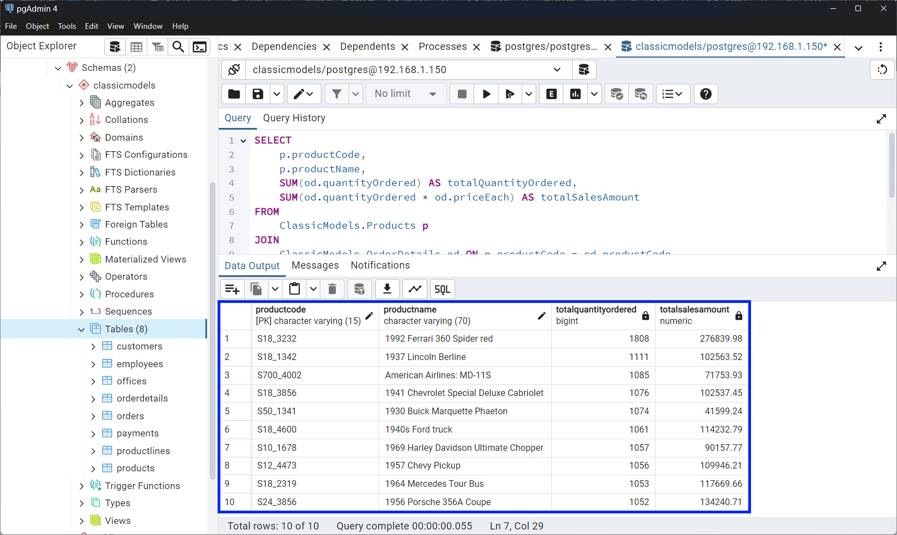
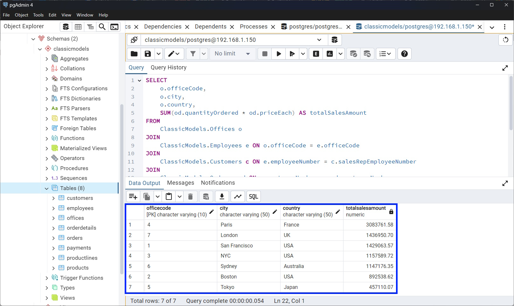
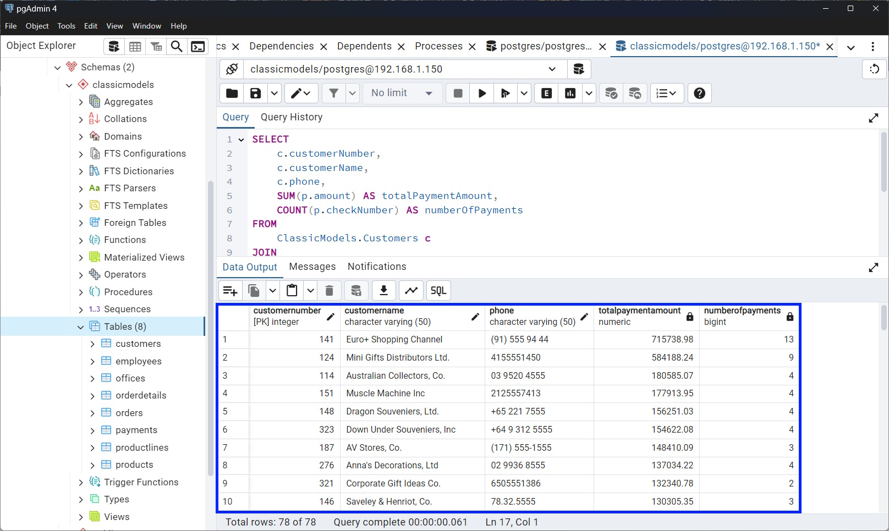

# Analyzing Business Insights from the Classic Models Database Using SQL Queries

This article focuses on solving three key business problems for Classic Models by analyzing different aspects of the company's operations through SQL queries. Each problem addresses a specific business need, extracting valuable insights from the data stored in the Classic Models database. We'll break down each problem, the objective behind it, and provide the SQL solution to obtain actionable information.

## Problem 1: Top-Selling Products Analysis

### Objective
The goal is to identify the top-selling products in terms of the total quantity ordered, which will help inform inventory management and marketing strategies. By focusing on high-demand products, Classic Models can optimize inventory and align marketing efforts.

### What You Need to Do
1. Identify the top 10 products based on the total quantity ordered.
2. For each product, retrieve the following information:
   - `productCode`: The unique identifier for the product.
   - `productName`: The name of the product.
   - The total quantity ordered across all orders.
   - The total sales amount (calculated as `quantityOrdered * priceEach`).
3. Sort the products by total quantity ordered in descending order.

### SQL Query
```sql
SELECT 
    p.productCode,
    p.productName,
    SUM(od.quantityOrdered) AS totalQuantityOrdered,
    SUM(od.quantityOrdered * od.priceEach) AS totalSalesAmount
FROM 
    ClassicModels.Products p
JOIN 
    ClassicModels.OrderDetails od ON p.productCode = od.productCode
GROUP BY 
    p.productCode, p.productName
ORDER BY 
    totalQuantityOrdered DESC
LIMIT 10;
```

### Explanation
- The query joins the `Products` and `OrderDetails` tables to retrieve product information and associated order details.
- It calculates the total quantity ordered and the total sales amount for each product.
- The query groups the results by `productCode` and `productName` and orders them by the total quantity ordered in descending order, limiting the output to the top 10 products.

### Example Result Set



---

## Problem 2: Sales Performance by Office

### Objective
Management wants to evaluate the sales performance of each office to determine how resources should be allocated and to recognize high-performing teams. This query will calculate the total sales amount generated by employees in each office.

### What You Need to Do
1. Calculate the total sales amount generated by employees working in each office.
2. For each office, retrieve the following information:
   - `officeCode`: The unique code identifying the office.
   - `city`: The city where the office is located.
   - `country`: The country where the office is located.
   - The total sales amount (sum of `quantityOrdered * priceEach` for all orders handled by employees in that office).
3. Include only offices with a total sales amount greater than $100,000.
4. Sort the results by total sales amount in descending order.

### SQL Query
```sql
SELECT 
    o.officeCode,
    o.city,
    o.country,
    SUM(od.quantityOrdered * od.priceEach) AS totalSalesAmount
FROM 
    ClassicModels.Offices o
JOIN 
    ClassicModels.Employees e ON o.officeCode = e.officeCode
JOIN 
    ClassicModels.Customers c ON e.employeeNumber = c.salesRepEmployeeNumber
JOIN 
    ClassicModels.Orders ord ON c.customerNumber = ord.customerNumber
JOIN 
    ClassicModels.OrderDetails od ON ord.orderNumber = od.orderNumber
GROUP BY 
    o.officeCode, o.city, o.country
HAVING 
    SUM(od.quantityOrdered * od.priceEach) > 100000
ORDER BY 
    totalSalesAmount DESC;
```

### Explanation
- The query joins the `Offices`, `Employees`, `Customers`, `Orders`, and `OrderDetails` tables to gather data on which employees from which offices handled orders.
- It calculates the total sales amount for each office and filters for offices where the sales exceed $100,000.
- The results are ordered by total sales amount in descending order.

### Example Result Set



---

## Problem 3: High-Value Customers Identification

### Objective
Classic Models aims to strengthen relationships with its most valuable customers by identifying those who have made large payments. This will allow the company to provide personalized services and retain their business.

### What You Need to Do
1. Identify customers whose total payments exceed $50,000.
2. For each customer, retrieve the following information:
   - `customerNumber`: The unique identifier for the customer.
   - `customerName`: The name of the customer.
   - `phone`: The customer's contact phone number.
   - The total payment amount (sum of `amount` from the `Payments` table).
   - The number of payments made by the customer.
3. Sort the results by the total payment amount in descending order.

### SQL Query
```sql
SELECT 
    c.customerNumber,
    c.customerName,
    c.phone,
    SUM(p.amount) AS totalPaymentAmount,
    COUNT(p.checkNumber) AS numberOfPayments
FROM 
    ClassicModels.Customers c
JOIN 
    ClassicModels.Payments p ON c.customerNumber = p.customerNumber
GROUP BY 
    c.customerNumber, c.customerName, c.phone
HAVING 
    SUM(p.amount) > 50000
ORDER BY 
    totalPaymentAmount DESC;
```

### Explanation
- The query joins the `Customers` and `Payments` tables to track customers who have made payments and how much they paid.
- It calculates the total payment amount and counts the number of payments for each customer.
- The `HAVING` clause ensures that only customers with payments exceeding $50,000 are included.

### Example Result Set



---

## Conclusion
These SQL queries provide essential insights into the business operations of Classic Models. By identifying top-selling products, evaluating office sales performance, and recognizing high-value customers, the company can make data-driven decisions to optimize inventory, allocate resources effectively, and strengthen relationships with its most profitable clients. SQL remains a powerful tool for turning raw data into actionable business intelligence.

